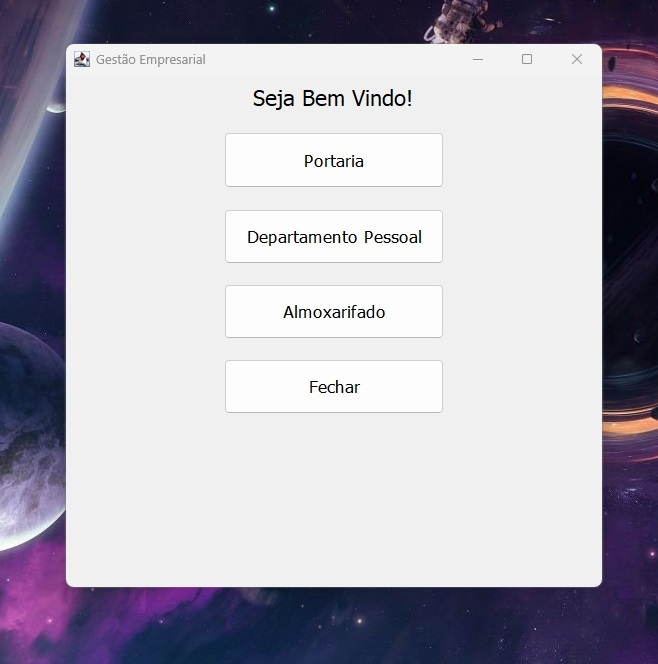
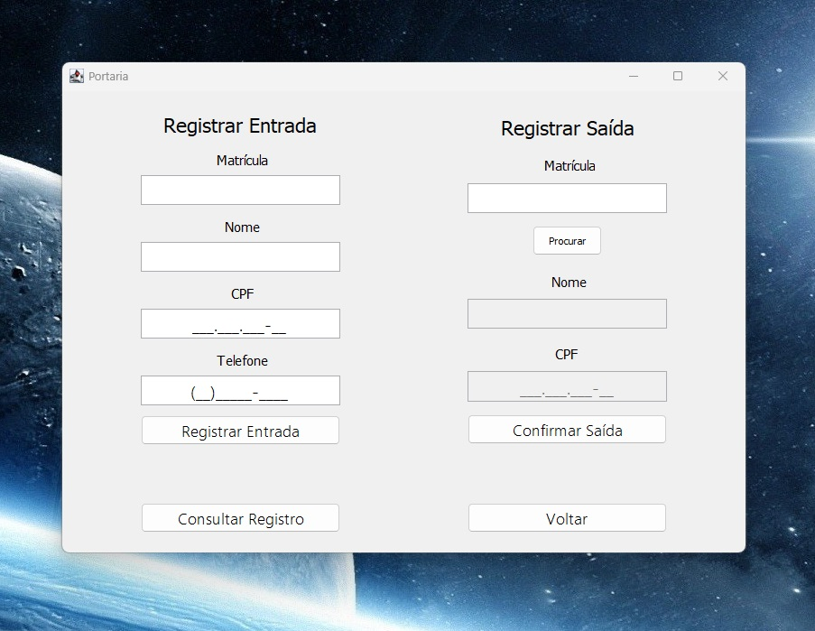
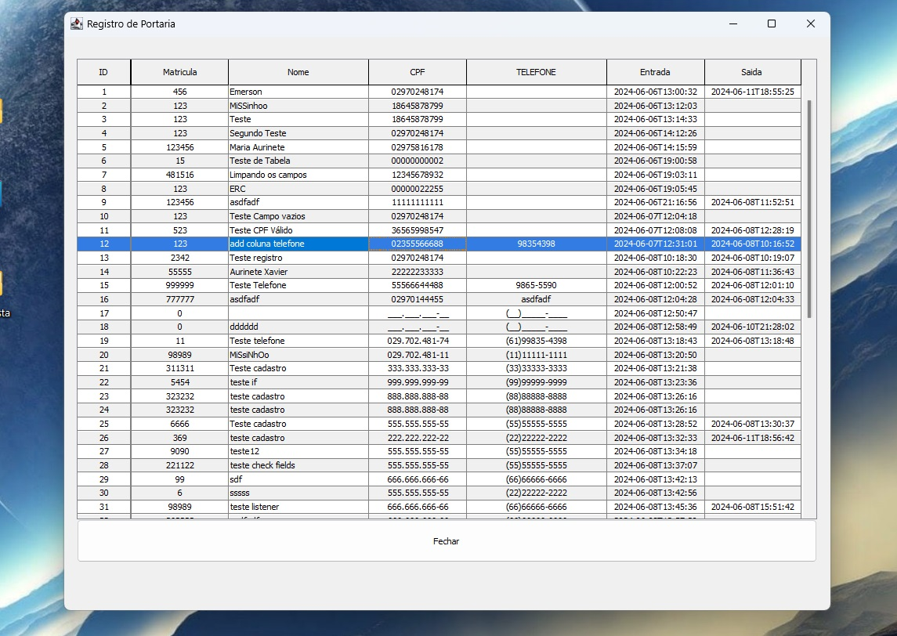
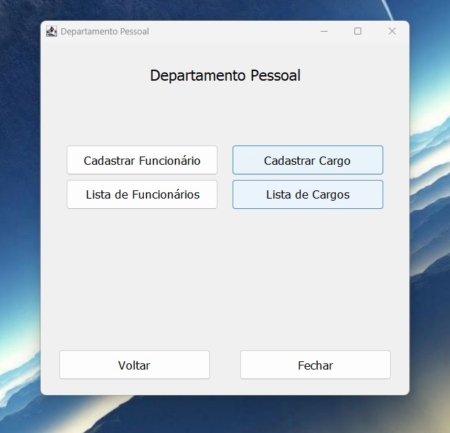
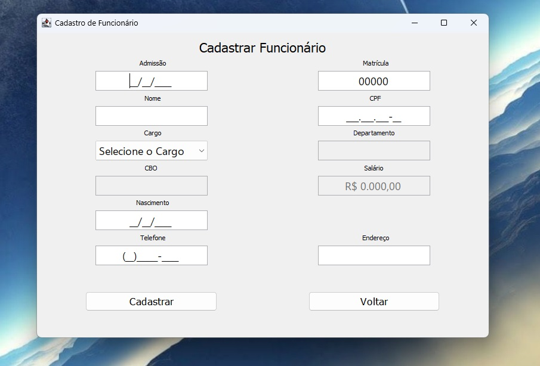
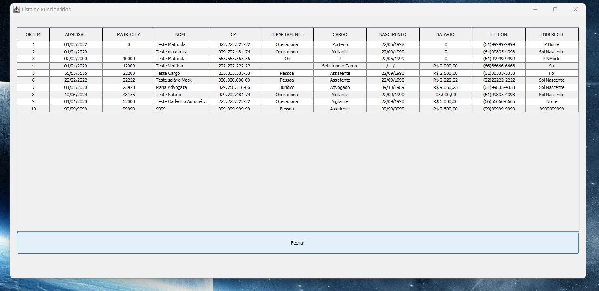
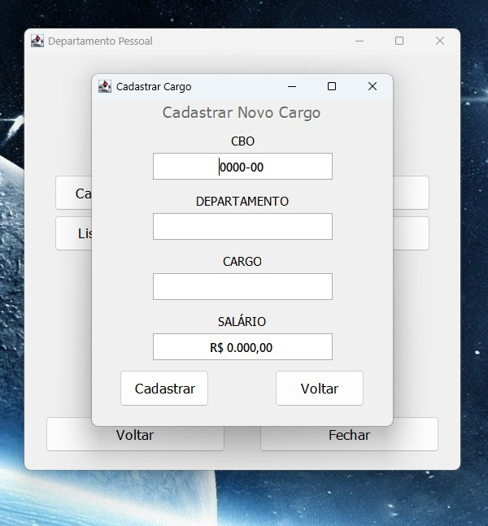
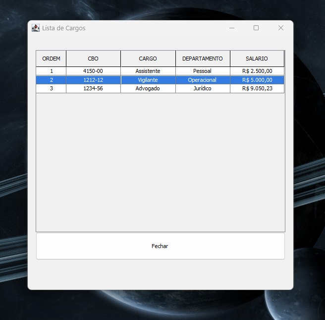

# Gestão Empresarial

Este é um sistema empresarial desenvolvido para auxiliar na gestão de entrada e saída de pessoas, bem como na administração de departamentos e funcionários. O sistema é dividido em duas partes principais: backend e frontend.

## Tecnologias Utilizadas

- **IntelliJ**: IDE utilizada para o desenvolvimento.
- **Java**: Utilizado tanto no backend quanto no frontend (Java Swing).
- **MySQL**: Banco de dados para armazenamento das informações.

## Funcionalidades

### Menu Portaria

- **Registro de Entrada e Saída de Pessoas**: Funcionalidade que permite registrar a entrada e saída de pessoas no sistema.
- **Armazenamento no MySQL**: Todos os registros de entrada e saída são salvos em um banco de dados MySQL.

### Departamento Pessoal

#### Tabela de Cargos

- **Criação de Cargos**: Permite criar e gerenciar os cargos dentro da empresa.
- **Campos Incluídos**: CBO, Cargo, Departamento e Salário.
- **Armazenamento no MySQL**: Todas as informações sobre cargos são salvas no banco de dados MySQL.

#### Tabela de Funcionários

- **Criação de Funcionários**: Permite criar novos registros de funcionários.
- **Associação a Cargos**: Cada funcionário só pode ser associado a um cargo existente na tabela de cargos.
    - **Preenchimento Automático**: Os dados do cargo (CBO, Cargo, Departamento e Salário) são preenchidos automaticamente ao selecionar um cargo existente.
- **Armazenamento no MySQL**: Todas as informações sobre funcionários são salvas no banco de dados MySQL.

## Estrutura do Projeto

- **Backend**: Contém toda a lógica de negócio e comunicação com o banco de dados MySQL.
- **Frontend (Java Swing)**: Interface gráfica que permite a interação dos usuários com o sistema.
- **Validação de Dados**: Todos os campos são verificados para evitar que o usuário adicione dados inválidos durante o registro, prevenindo assim a ocorrência de exceções.

*Projeto ainda em andamento*

## Screenshots

Para uma melhor visualização do sistema, aqui estão alguns prints das telas principais:

 | 
|:---:|:---:|

 | 
|:---:|:---:|

 | 
|:---:|:---:|

 | 
|:---:|:---:|

